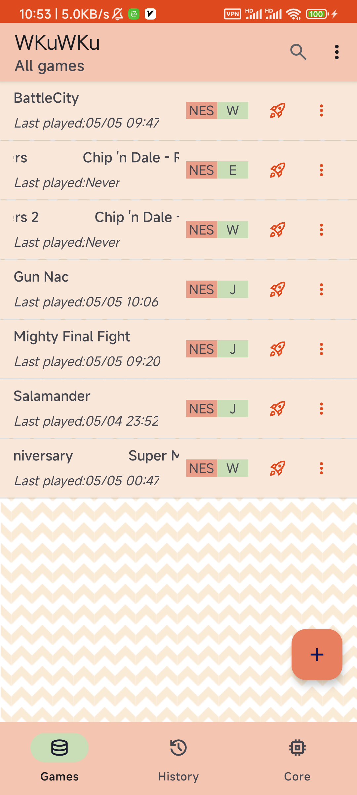
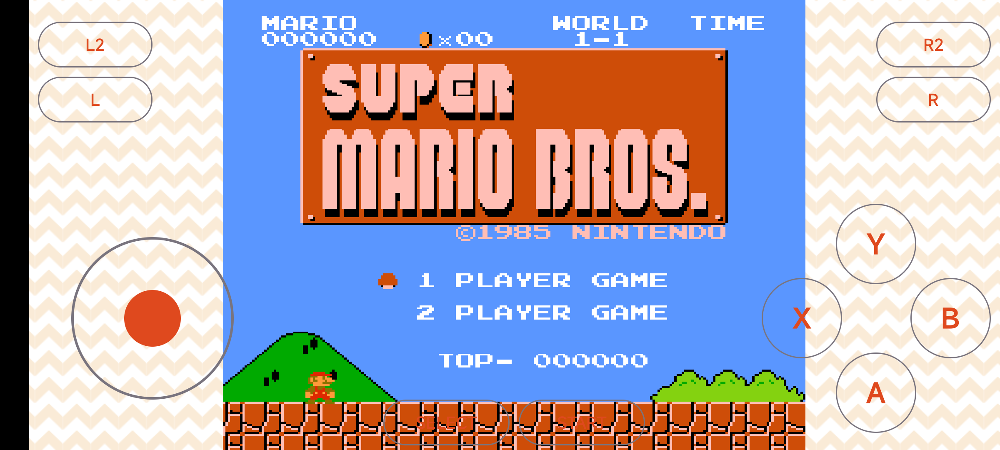
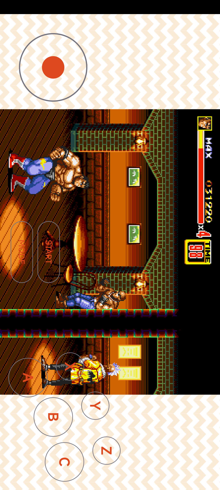

# WKuWKu 

|  |  |  |  |
| ------------------------------------------ | ------------------------------------------ | ------------------------------------------ | ------------------------------------------ |

## What is WKuWKu ?

> This is a [Libretro](https://www.libretro.com/) frontend implementation for the Android platform.

## What can it currently do ?
> Currently, it integrates the [libretro-fceumm](https://github.com/libretro/libretro-fceumm) and [genesis-plus-gx](https://github.com/libretro/Genesis-Plus-GX) core, So you can use it to play classic games from Nintendo or Sega platforms directly on your Android phone.

## What's next ?
> - Continue to improve various basic functions (as you can see, many functions are still only on the interface and have not yet been implemented.)
> - Support more interesting platforms! (ps：sega genesis、snes、gameboy、even the arcade platform!)

## Want to contribute ?

> This project welcomes any code or test contributions. If you have any intention in this regard, please send an email wn123o@outlook.com.

## At last

Have fun!
