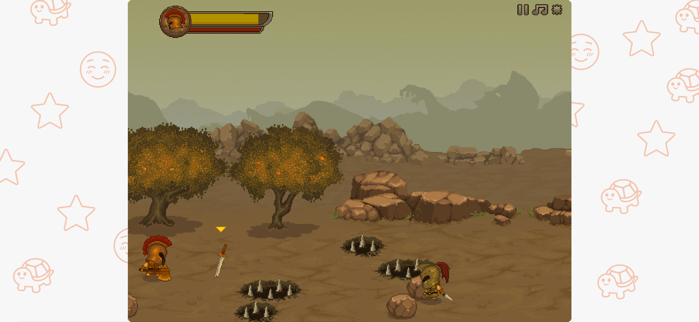

# WKuWKu 

|  |  |  |  |
|--------------------------------------------------------|--------------------------------------------------------|--------------------------------------------------------|--------------------------------------------------------|
|  |  |  |  |

## What is WKuWKu ?

> This is a [Libretro](https://www.libretro.com/) frontend implementation for the Android platform.

## What systems are currently supported?

| System                              | manufacturer | optional core   |
|-------------------------------------|--------------|-----------------|
| Nintendo Entertainment System       | Nintendo     | fceumm、mesen    |
| Family Computer                     | Nintendo     | fceumm、mesen    |
| Super Nintendo Entertainment System | Nintendo     | mesen-s         |
| Game Boy                            | Nintendo     | mesen-s         |
| Game Boy Color                      | Nintendo     | mesen-s         |
| Game Gear                           | Sega         | genesis plus gx |
| Master System                       | Sega         | genesis plus gx |
| Mega-CD                             | Sega         | genesis plus gx |
| Mega Drive                          | Sega         | genesis plus gx |
| PICO                                | Sega         | genesis plus gx |
| SG-1000                             | Sega         | genesis plus gx |
| Play Station                        | Sony         | pcsx            |
| Arcade                              | NA           | mame2003-plus   |

## What's next ?

> - Continue to improve various basic functions (as you can see, many functions are still only on the interface and have not yet been implemented.)
> - Support more interesting platforms! (ps：sega genesis、snes、gameboy、even the arcade platform!)

## At last

Have fun!
