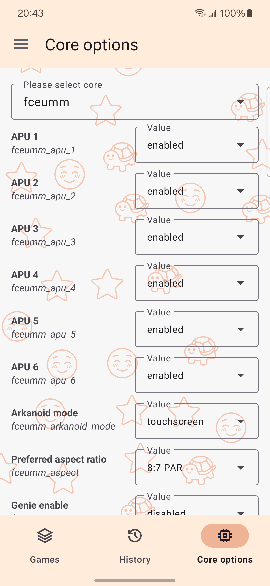

# WKuWKu

    

[[简体中文]](README.zh_CN.md)

## Screenshots

|  |  |  |  |
| ------------------------------------------------------------ | ------------------------------------------------------------ | ------------------------------------------------------------ | ------------------------------------------------------------ |
|  |  |  |  |

## What is WKuWKu ?

WkuWku aims to transform your existing Android devices into a multi-platform retro gaming console, allowing you to enjoy classic retro games anytime, anywhere—much like [RetroArch](https://github.com/libretro/RetroArch). However, unlike RetroArch, its goal is not only to run various [libretro](https://www.libretro.com/index.php/api/) cores, but also to support other systems — such as running [Flash](https://en.wikipedia.org/wiki/Adobe_Flash) content through [Ruffle](https://github.com/ruffle-rs/ruffle). In short, it is a libretro frontend, but also more than just a libretro frontend.

## What's goal?

- Feature-rich and stable;
- Simple yet aesthetically pleasing in design;
- Easy to operate;
- Lightweight;
- iOS support? (Perhaps)

> Update frequency is weekly

## What is the current status?

The project is currently in **development**, with many features not yet finalized or requiring testing. If you’re interested in the application, feel free to visit the [release page](https://github.com/TTTUUUIII/WKuWKu/releases) to download and try it out.

### Compatibility status:

| System                    | Optional cores                    | Available |
| ------------------------- | --------------------------------- | --------- |
| Nintendo - NES/FC         | `Fceumm`、`Mesen`                 | ✅         |
| Nintendo - SNES           | `Snes9x`、`BSNES`                 | ✅         |
| Nintendo - GameBoy        | `SameBoy`、`VBA-M`                | ✅         |
| Nintendo - GameBoyColor   | `SameBoy`、`VBA-M`                | ✅         |
| Nintendo - GameBoyAdvance | `mGBA`、`VBA Next`、`VBA-M`       | ✅         |
| Nintendo - Pokémon Mini   | `PokeMini`                        | ✅         |
| Nintendo - DS             | `MelonDS`                         | ✅         |
| Nintendo - 3DS            | `Citra`                           | ✅         |
| Nintendo - N64            | `N/A`                             | ❌         |
| Nintendo - GameCube/Wii   | `N/A`                             | ❌         |
| Sega - Game Gear          | `Genesis Plus GX`                 | ✅         |
| Sega - Master System      | `Genesis Plus GX`                 | ✅         |
| Sega - Mega-CD            | `Genesis Plus GX`                 | ✅         |
| Sega - Mega Drive/Genesis | `Genesis Plus GX`                 | ✅         |
| Sega - Saturn             | `Beetle Saturn`、`Yabause`        | ✅         |
| Sega - PICO               | `Genesis Plus GX`                 | ✅         |
| Sega - SG-1000            | `Genesis Plus GX`                 | ✅         |
| Sony - PlayStation        | `PCSX`                            | ✅         |
| Sony - PlayStation2       | `N/A`                             | ❌         |
| NEC - PC Engine           | `Geargrafx`                       | ✅         |
| Atari - Atari 7800        | `ProSystem`                       | ✅         |
| Microsoft - MSX           | `FMSX`                            | ✅         |
| Microsoft - MSX2          | `FMSX`                            | ✅         |
| Arcade                    | `MAME`、`FBNeo`、`MAME-2003-Plus` | ✅         |

## At last

Have fun!
