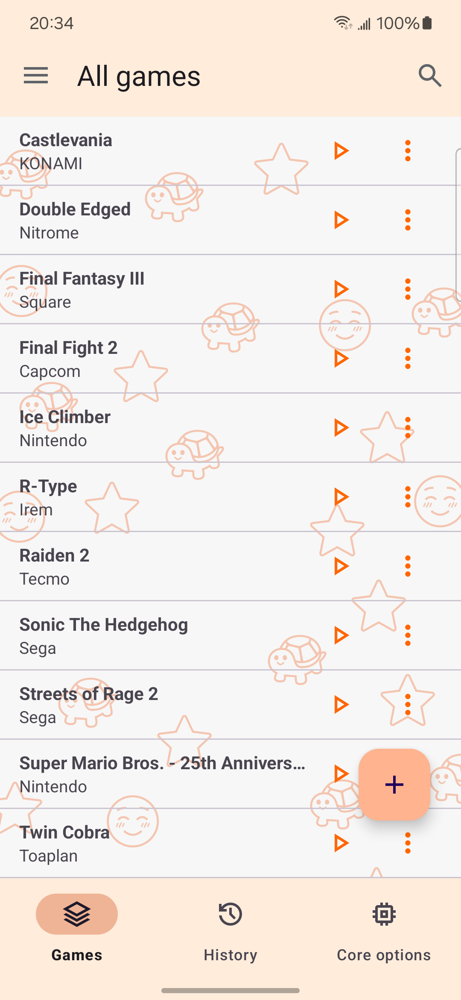
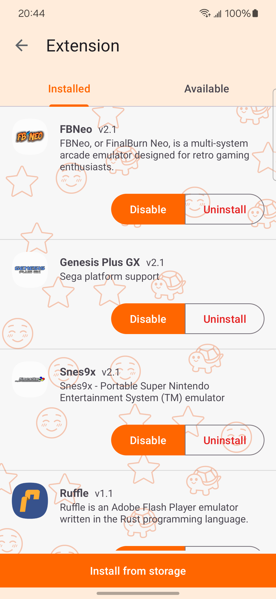
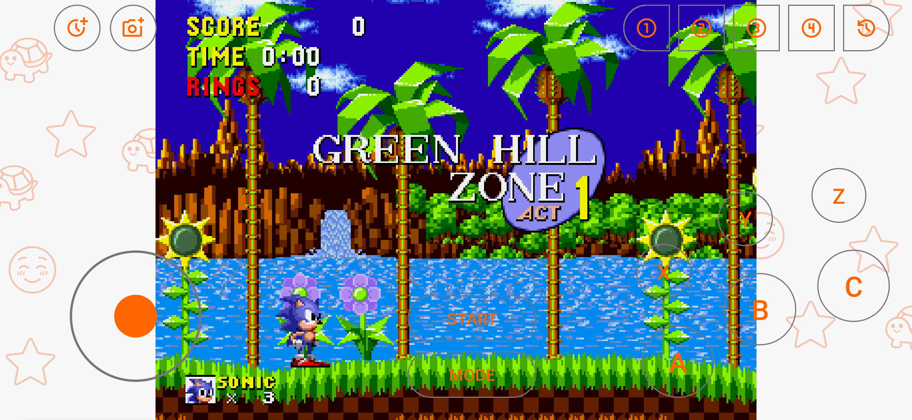

# WKuWKu

## 截图

|  |  |  |  |
| ------------------------------------------------------------ | ------------------------------------------------------------ | ------------------------------------------------------------ | ------------------------------------------------------------ |
|  |  |  |  |

## WKuWKu是什么？

WkuWku的目标是将您身边现有的Android设备变成一个多平台的复古游戏机，以便让您可以随时随地游玩那些经典的复古游戏，就像RetroArch一样，但和[RertoArch](https://github.com/libretro/RetroArch)不同的点是，它的目标并不只是运行各种[libretro](https://www.libretro.com/index.php/api/)核心，也可能是其它系统(例如：通过[ruffle](https://github.com/ruffle-rs/ruffle)运行[Flash](https://zh.wikipedia.org/wiki/Adobe_Flash)内容)。简单来说，它是一个libretro前端，但又不只是一个libretro前端。

## 目标是什么？

- 功能丰富且稳定
- 界面简洁但美观
- 操作简单
- 小巧
- iOS支持？(也许)

> 更新频率为每周

## 进展如何？

目前项目处于**开发阶段**，许多功能还未实现或需要测试。如果您对这个应用感兴趣, 欢迎前往[发布页](https://github.com/TTTUUUIII/WKuWKu/releases)下载使用。

### 目前支持的系统：

| System                              | manufacturer | optional core       |
|-------------------------------------|--------------|---------------------|
| Nintendo Entertainment System       | Nintendo     | fceumm、mesen        |
| Family Computer                     | Nintendo     | fceumm、mesen        |
| Nintendo DS                         | Nintendo     | melonDS             |
| Super Nintendo Entertainment System | Nintendo     | snes9x              |
| Game Boy                            | Nintendo     | sameboy             |
| Game Boy Color                      | Nintendo     | sameboy             |
| Game Gear                           | Sega         | genesis plus gx     |
| Master System                       | Sega         | genesis plus gx     |
| Mega-CD                             | Sega         | genesis plus gx     |
| Mega Drive/Genesis                  | Sega         | genesis plus gx     |
| Saturn                              | Sega         | mednafen saturn     |
| PICO                                | Sega         | genesis plus gx     |
| SG-1000                             | Sega         | genesis plus gx     |
| Play Station                        | Sony         | pcsx                |
| Arcade                              | N/A          | mame2003-plus、fbneo |
| PC Engine                           | NEC          | geargrafx           |
| Flash                               | Adobe        | ruffle              |

## 最后

玩的开心！
